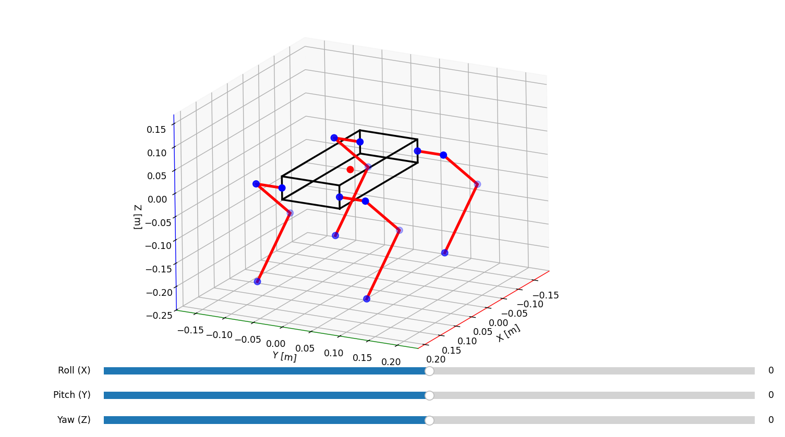
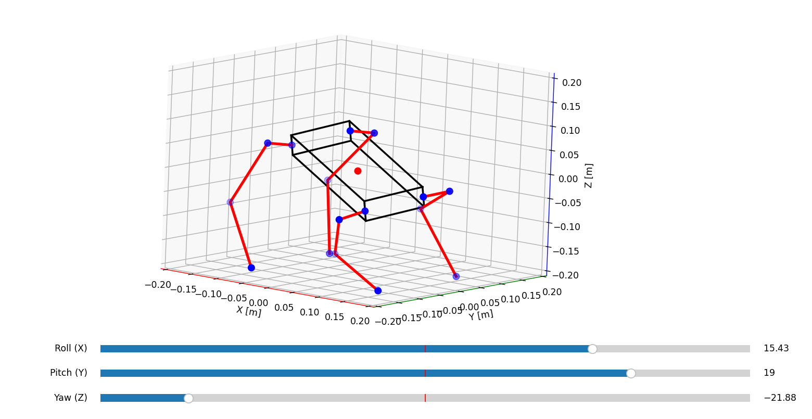
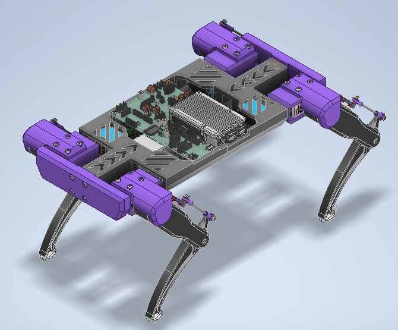
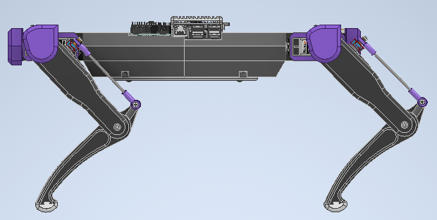

# Quadruped Robot - Inverse Kinematics

Python implementation of inverse kinematics for a quadruped robot.

The program calculates compensation for each leg to enable the robot to rotate by a defined angle around a chosen axis.

## GUI and visualization view

View of default and rotated position.

## Equations and Diagrams

We always calculate angles θ₂ and θ₃ by looking perpendicular to the leg. Therefore, we need to rotate our coordinate system by angle θ₁ to obtain this perpendicular view (see `quadruped_inverse.py`, line 114).

## Mechanical design

The quadruped robot’s structure is fully 3D-printed, with both the body and legs assembled using threaded brass inserts and screws to ensure strong and precise connections.
All joint axes are supported by machine bearings, which provide smooth and durable movement.
The leg tips are printed from TPU material, improving traction and shock absorption during walking.
To increase rigidity, the robot’s body is reinforced with two threaded rods running along its entire length, ensuring structural stability under load.

.png>)

