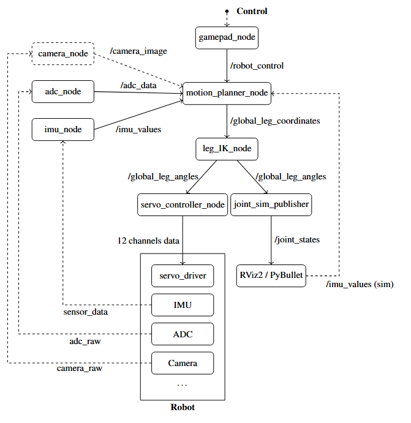

# CzlapCzlap-Quadruped
A grant project for a quadrupedal walking robot developed by members of the KN Integra student research group.

## ROS2 Packages and Nodes

The control software for the quadruped robot **CzłapCzłap** is organized into several ROS2 packages.  
Each package is responsible for a specific layer of the control architecture - from user input and motion planning to hardware or simulation interfaces.  
This modular design allows for seamless switching between real hardware and simulation environments while maintaining a unified communication structure.

Below is a brief overview of the key packages and their corresponding nodes.

### motion_planner
Implements gait generation, trajectory planning, and motion coordination.  
Main node: `motion_planner_node`  
- Generates leg trajectories based on selected gait configuration.  
- Uses IMU data for stabilization and adaptive correction.  
- Integrates modules: `gait_planner`, `trajectory_planner`, `state_machine`.

### leg_controller
Handles inverse kinematics for all legs.  
Main node: `leg_IK_node`  
- Subscribes to `/global_leg_coordinates`.  
- Computes joint angles and publishes `/global_leg_angles`.

### servo_controller
Low-level interface for servo communication via UART.  
Main node: `servo_controller_node`  
- Converts joint angles to PWM signals.  
- Sends commands to servo driver and manages calibration offsets.

### robot_control
Provides user input interfaces.  
Nodes: `keyboard_node`, `gamepad_node`  
- Publishes control events to the motion planner.  
- Interfaces with keyboard or SPI-based gamepad.

### czlapczlap_sim
Simulation environment using PyBullet.  
Main node: `czlapczlap_sim_node`  
- Loads URDF model and simulates physical behavior.  
- Subscribes to `/global_leg_angles` and visualizes robot motion.  
- Shares the same topics as hardware for unified testing.

### sensor_interface
Manages sensor data acquisition and filtering.  
Nodes: `imu_node`, `adc_node`  
- `imu_node`: reads IMU data, applies Madgwick filter, publishes `/imu_values`.  
- `adc_node`: reads analog data and publishes `/adc_data`.

## System Architecture
Below is the architecture of the control system for the quadruped robot **CzłapCzłap**.  
The diagram illustrates the communication flow between ROS2 nodes and the modular structure of the software.  
The system supports control of both the **physical robot** and its **PyBullet simulation**, using the same message format and communication interface - `/global_leg_angles`.
This allows seamless switching between hardware testing and virtual experiments without modifying the control logic.

---

