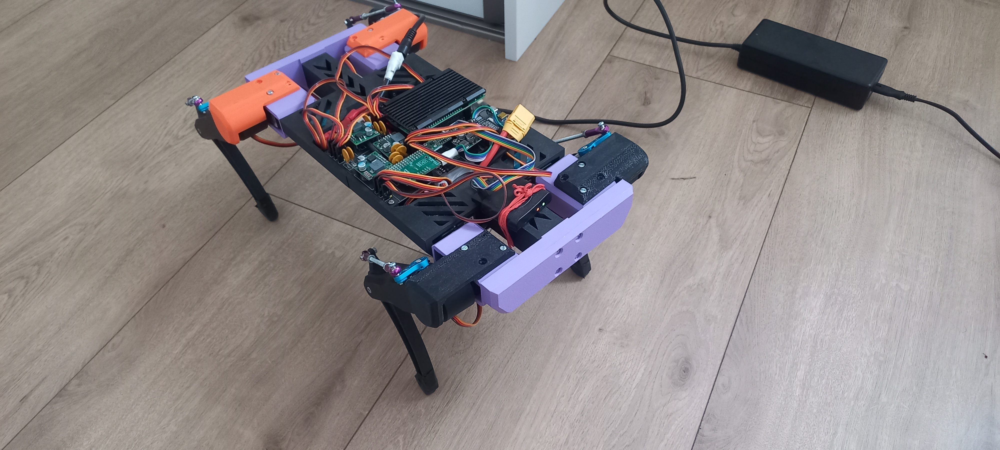

# CzlapCzlap-Quadruped
A grant project for a quadrupedal walking robot by members of the KN Integra.  
CzłapCzap is a quadrupedal walking robot designed for research, prototyping, and educational purposes.

* **Electronics** – includes PCB design files (.gbr) viewable in KiCad EDA, along with a brief description of the custom schematic for the robot's control electronics.
* **Mechanics** – contains CAD models and assembly diagrams illustrating the robot's structure and joint configuration.
* **Software** – implements the control system using ROS2 and Python, with modular nodes for motion planning, leg kinematics, sensor handling, and hardware/simulation interfaces. Main code is available in a private repository. The architecture allows seamless switching between simulation (PyBullet) and real hardware while maintaining unified control logic.

## September 2025

### Videos

## September 2024

## May 2024

## January 2024

